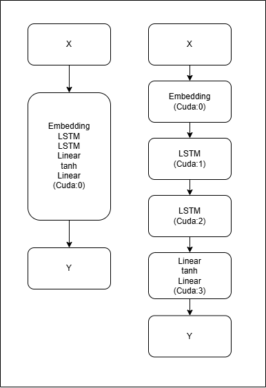
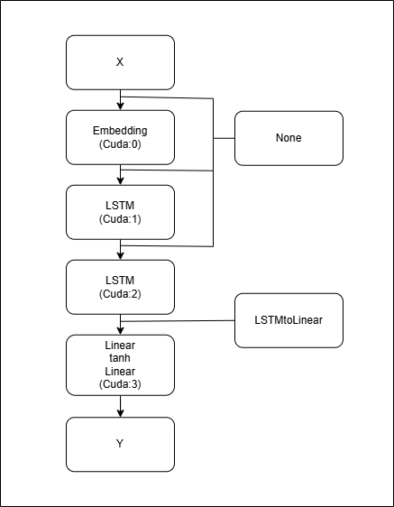

# DecoupleFlow 使用指南

## DecoupleFlow 介紹

### 什麼是 DecoupleFlow？

DecoupleFlow 是一個 Python 套件，用來把你已經寫好的模型（通常是 `torch.nn.Sequential` 組成的「層序列」）改造成「可分區（Block）訓練」的架構，讓每個 Block 都能用自己的局部目標（local objective）更新參數，並支援把不同 Block 放到不同裝置（CPU / 多張 GPU）上執行。

### 安裝需求與安裝方式

- **Python**：3.9 以上（含 3.9）
- **PyTorch**：`torch>=2.0`（是否支援 CUDA 取決於你安裝的 torch 版本）

目前專案放在 GitHub 上，套件名稱在 `pyproject.toml` 中為 `decoupleflow`。開發與實驗建議使用「從 GitHub 下載原始碼 + 可編輯安裝 (`pip install -e .`)」的方式。

1. **從 GitHub 下載專案**

   若已安裝 `git`，推薦用 clone：

   ```bash
   # 下載原始碼
   git clone https://github.com/lyt0310603/DecoupleFlow.git

   # 進到專案根目錄（包含 pyproject.toml 的那層）
   cd DecoupleFlow
   ```

   若沒有 `git` 或在受限環境，也可以：

   - 到專案的 GitHub 頁面（`https://github.com/lyt0310603/DecoupleFlow`）
   - 點選「Code」→「Download ZIP」
   - 解壓縮後，用終端機進到解壓縮後的資料夾

2. **使用 `pip install -e .` 進行可編輯安裝**

   在專案根目錄（與 `pyproject.toml` 同一層）執行：

   ```bash
   pip install -e .
   ```

   - 這會以「editable mode」安裝 `decoupleflow`，之後你在此資料夾內修改原始碼，Python 直接就能看到最新變更。
   - 安裝成功後，在任何虛擬環境中都可以：

   ```python
   from decoupleflow import DecoupleFlow
   ```

## 核心概念

- **Block（區塊）切分**：DecoupleFlow 會把你的 `custom_model` 依照 `device_map` 切成多個 Block，每個 Block 會包成一個 `BasicBlock`（或 adaptive 模式下的 `AdaptiveBasicBlock`）。
- **裝置分配**：每個 Block 可以分配到不同裝置（例如 `cuda:0`、`cuda:1`），並且在 Block 之間用 `detach()` 隔離梯度，達到 decoupled training 的核心效果。
- **局部損失（local loss）**：中間 Block 的 loss 可使用 `CL`（Supervised Contrastive）或 `DeInfo`（information regularization），最後一個 Block（在非 adaptive 模式）會強制使用 `CE`（CrossEntropy）。
- **訓練迴圈盡量保持 PyTorch 習慣**：你仍然可以用 `model.train()` / `model.eval()` 控制模式，並在每步呼叫 `model(X, Y)` 進行訓練或推理。


* 上圖為 DecoupleFlow 分割策略示意圖，左側為使用 Pytorch 搭建的模型，右側為使用 DecoupleFlow 重構後的模型。

## 輸入輸出

### 訓練（training）

訓練時建議直接呼叫 `model(X, Y)`（在 `model.train()` 狀態下會自動分派到訓練流程）：

- **輸入**：`X`, `Y`, 可選 `mask`
- **輸出**：`features, total_loss, labels`
  - `features`：最後一個 Block 的輸出特徵（通常是 logits 或 features，取決於你的 backbone 最後一層）
  - `total_loss`：所有 Block 的局部 loss 加總後的 Python `float`
  - `labels`：移動到最後一個 Block 裝置上的 labels

```python
model.train()
features, total_loss, labels = model(X, Y, mask=mask)
```

若你需要在程式碼中明確區分訓練與推論函式，也可以直接呼叫 `train_step`：

```python
model.train()
features, total_loss, labels = model.train_step(X, Y, mask=mask)
```

### 測試（testing / inference）

測試時建議直接呼叫 `model(X, Y)`（在 `model.eval()` 狀態下會自動分派到推論流程）：

- **輸入**：`X`, `Y`, 可選 `mask`
- **輸出**：`output, labels`

```python
model.eval()
output, labels = model(X, Y, mask=mask)
```

若你需要在程式碼中明確指定推論函式，也可以直接呼叫 `test_step`：

```python
model.eval()
output, labels = model.test_step(X, Y, mask=mask)
```

### Adaptive 推理模式（Early Exit）

當 `is_adaptive=True` 時，`model.eval()` 下直接呼叫 `model(X, Y)` 會分派到 adaptive 推理流程，回傳：

- **輸出**：`classifier_output, stop_layer_index, labels`

```python
model.eval()
classifier_output, stop_layer, labels = model(X, Y, mask=mask)
```

若你需要明確呼叫函式，也可以使用 `adaptive_test_step`：

```python
model.eval()
classifier_output, stop_layer, labels = model.adaptive_test_step(X, Y, mask=mask)
```

> 注意：adaptive 模式下，每個 Block 會多一個 classifier（見 `classifier` 參數），並用相鄰層 logits 的 cosine similarity 與 argmax 是否一致作為早停條件。

## 參數介紹（建立 `DecoupleFlow` 時）

`DecoupleFlow` 的必要參數是 `custom_model`、`device_map`。常用可選參數包含 `loss_fn`、`num_classes`、`projector_type`、`custom_projector`、`transform_funcs`、`optimizer_fn`、`optimizer_param`、`scheduler_fn`、`scheduler_param`、`multi_t`、`is_adaptive`、`patiencethreshold`、`cosinesimthreshold`、`classifier`。

### custom_model

**功用**：提供要被 DecoupleFlow 切分成多個 Block 的骨幹模型本體。
- **建議**：用 `torch.nn.Sequential` 組成「可被切分」的模型。

```python
import torch.nn as nn

backbone = nn.Sequential(
    nn.Linear(768, 512),
    nn.ReLU(),
    nn.Linear(512, 256),
    nn.ReLU(),
    nn.Linear(256, 4),
)
```

你也可以在 `Sequential` 中放入**自定義類別形式**的模組。  
需要注意的是，自定義模組的 `forward` 回傳格式會影響 local loss 的計算：

- 若不需要額外處理，可直接回傳單一輸出 `result`。
- 若需要另外指定用於 loss 的特徵，請回傳 `(result, for_loss)`。
  - 例如某些序列模型你可能希望拿特定 pooled 特徵（如平均後的 hidden state）來算 loss。
  - 當作為該區塊的最後一層時，`for_loss` 將參與進 local loss 計算

> 補充：若你直接使用 `nn.LSTM`，DecoupleFlow 內部已內建處理流程，會自動取可用於 local loss 的特徵；只有你自訂 layer 且需要特別指定時，才需要回傳第二個值。

簡單範例如下：

```python
import torch.nn as nn

class CustomLayer(nn.Module):
    def __init__(self, in_dim=16, out_dim=8):
        super().__init__()
        self.fc = nn.Linear(in_dim, out_dim)

    def forward(self, x):
        result = self.fc(x)
        for_loss = result.mean(dim=1)  # 示意：另外指定給 local loss 的特徵
        return result, for_loss

model = nn.Sequential(
    nn.Linear(32, 16),
    CustomLayer(16, 8),
    nn.ReLU(),
    nn.Linear(8, 2),
)
```

### device_map

**功用**：定義每個 Block 要切幾層、並指定每個 Block 佈署到哪個裝置。
你可以用兩種格式：

1) **dict 格式**：`{device: layers_count, ...}`

```python
device_map = {"cuda:0": 2, "cuda:1": 2, "cuda:2": 1}
```

2) **list 格式**：每段用 `{"device": "...", "layers": ...}` 表示（當想把不同區塊放至同一裝置時使用）

```python
device_map = [
    {"device": "cpu", "layers": 1},
    {"device": "cpu", "layers": 1},
    {"device": "cpu", "layers": 1},
]
```

`layers` 的邏輯是「**由前到後累加切分**」，不是指定某一層的絕對編號。  
也就是說，DecoupleFlow 會從 `custom_model` 第 1 層開始，依照 `device_map` 順序連續分配：

- 第 1 段拿前 `layers` 層
- 第 2 段接著拿下一批 `layers` 層
- 依此類推直到分完全部層

例如 `device_map = {"cuda:0": 2, "cuda:1": 2, "cuda:2": 1}` 時：

- `cuda:0` 取得第 1-2 層
- `cuda:1` 取得第 3-4 層
- `cuda:2` 取得第 5 層

先看最小可讀範例（3 層模型）：

```python
import torch.nn as nn

model = nn.Sequential(
    nn.Linear(32, 16),
    nn.ReLU(),
    nn.Linear(16, 2),
)

device_map = {"cuda:0": 2, "cuda:1": 1}
```

進階：對應到 NLP 結構的分配範例：

```python
import torch.nn as nn

model = nn.Sequential(
    nn.Embedding(num_embeddings=5000, embedding_dim=128),
    nn.LSTM(input_size=128, hidden_size=256, batch_first=True),
    nn.LSTM(input_size=256, hidden_size=256, batch_first=True),
    nn.Linear(256, 128),
    nn.Tanh(),
    nn.Linear(128, 2),
)

device_map = {
    "cuda:0": 1,  # 分配 Embedding 至 GPU 0
    "cuda:1": 1,  # 分配第一個 LSTM 至 GPU 1
    "cuda:2": 1,  # 分配第二個 LSTM 至 GPU 2
    "cuda:3": 3,  # 分配剩餘線性層至 GPU 3
}
```

重要限制：

- `device_map` **不能是 None**
- `sum(layers)` 必須等於 `len(custom_model)`（Sequential 的 layer 數）
- 每個 item 的 `layers` 必須 `> 0`
- 每個 item 的 `device` 不能是 `None`

### loss_fn

**功用**：指定各 Block 的局部損失函數類型，控制每個 Block 如何學習。
目前 `loss_fn` **必須是字串**，可用：

- `"CL"`：Supervised Contrastive Loss（中間 Block 預設）
- `"DeInfo"`：DeInfo Loss（需要 `num_classes`）

> 在非 adaptive 模式下，最後一個 Block 會被自動設定為 `"CE"`，中間 Block 使用你傳入的 `loss_fn`。

### num_classes

**功用**：提供類別數，讓 `DeInfo` loss 與 adaptive classifier 能建立正確輸出維度。
`num_classes` 代表資料集的**標籤類別數量**（例如二元分類是 `2`、MNIST 是 `10`）
`num_classes` 在以下情況需要：

- 你使用 `loss_fn="DeInfo"` 時 **必須提供**
- adaptive 模式下，若 `classifier=None`（使用套件內建 classifier）時會用到它

> 若你有自行傳入 `classifier`，則以你定義的 classifier 架構為主；套件不會依 `num_classes` 自動重建你的 classifier。

### projector_type 與 custom_projector

**功用（projector_type）**：決定每個 Block 在計算 local loss 前要套用哪種投影頭。
**功用（custom_projector）**：在 `projector_type="c"` 時，讓你傳入自訂投影模組。
`projector_type` 目前支援：

- `"i"`：Identity（不改變維度）
- `"l"`：單層 Linear（lazy）
- `"mlp"`：兩層 MLP（lazy -> 512 -> 1024）
- `"DeInfo"`：DeInfo projector（較深的 MLP）
- `"c"`：自訂 projector（你要用 `custom_projector` 傳入一個 `torch.nn.Module`）

> 備註：內建 projector 會大量使用 `nn.LazyLinear`，主要原因是 DecoupleFlow 在切分 Block 後，各 Block 的輸出維度可能不同，初始化階段不一定能先知道 `in_features`。  
> 使用 lazy layer 可以在第一次 forward 時自動推斷輸入維度，減少手動計算維度與改模型時的維護成本。

自訂 projector 範例：

```python
import torch.nn as nn

custom_projector = nn.Sequential(
    nn.LazyLinear(128),
    nn.ReLU(),
    nn.Linear(128, 64),
)

model = DecoupleFlow(
    custom_model=backbone,
    device_map=device_map,
    loss_fn="CL",
    num_classes=4,
    projector_type="c",
    custom_projector=custom_projector,
)
```

### transform_funcs（Block 間轉換函式）

**功用**：控制 Block 與 Block 之間的特徵轉換方式，確保下一個 Block 收到正確格式的輸入。
`transform_funcs` 是一個 list，長度必須等於 Block 數（也就是 `device_map` 切出的段數）。每個元素是：

- `callable`：用來把「上一個 Block 的輸出（list of tensors）」轉成下一個 Block encoder 需要的輸入
- 或 `None`：代表使用預設轉換（取第一個輸入 tensor）

為什麼需要它？

- `BasicBlock` 內部會把上一段的輸出以「list」形式傳遞；如果你的 layer 會回傳複合結果（例如 RNN/Transformer 等），你可能需要自行選取其中一部分餵給下一段。

一般而言，LSTM 傳遞至 Linear 層時會取 `x[:, -1, :]`，也就是最後一個時間步的輸出。先看一般 PyTorch 寫法範例：

```python
import torch.nn as nn

class CustomModel(nn.Module):
    def __init__(self, embedding_size, vocab_size, hidden_size, output_size):
        super(CustomModel, self).__init__()
        self.embedding = nn.Embedding(vocab_size, embedding_size)
        self.lstm1 = nn.LSTM(embedding_size, hidden_size, batch_first=True)
        self.lstm2 = nn.LSTM(hidden_size, hidden_size, batch_first=True)
        self.fc1 = nn.Linear(hidden_size, hidden_size)
        self.tanh = nn.Tanh()
        self.fc2 = nn.Linear(hidden_size, output_size)

    def forward(self, x):
        x = self.embedding(x)
        x, _ = self.lstm1(x)
        x, _ = self.lstm2(x)
        x = self.fc1(x[:, -1, :])  # use the last output of LSTM
        x = self.tanh(x)
        x = self.fc2(x)
        return x
```

在 DecoupleFlow 中，因為模型被切成多個 Block，若切分點剛好在 LSTM 與 Linear 之間，仍需要保留「取 last output」這個操作，所以要用第二種寫法：透過 `transform_funcs` 明確加入轉換函數，確保 LSTM 與 Linear 間的維度傳遞不會出錯。

以下範例以前面章節的 `backbone` 與 `device_map` 為主（也就是 LSTM 與分類層被切到不同 Block 的設定）：

```python
# LSTM 傳至分類層時須經過變換
# 因為 nn.LSTM 的回傳值為 x, (h, c)，所以轉換函數的參數定義成 x, h, c
def LSTMtoLinear(x, h, c):
    return x[:, -1, :]

# 不需要傳入變換函數則傳入 None 即可
# 前面範例將模型切分為 4 個 block，因此 transform_funcs 長度須為 4
# 在第三區塊 (LSTM) 與第四區塊 (Linear) 間插入轉換函數
transform_funcs = [None, None, None, LSTMtoLinear]
```


* 上圖為 transform_funcs 作用示意圖，DecopleFlow 會在 block 間插入轉換函數

### optimizer_fn / optimizer_param

**功用（optimizer_fn）**：指定每個 Block 使用哪一種 optimizer 類別。
**功用（optimizer_param）**：提供該 optimizer 的超參數（例如 `lr`、`momentum`）。
  - 傳入的 optimizer 超參數需要符合選用的 optimizer 的規範
DecoupleFlow 會為每個 Block 建一個 optimizer，你只要傳 optimizer 類別與參數 dict：

```python
import torch

optimizer_fn = torch.optim.SGD
optimizer_param = {"lr": 0.01, "momentum": 0.9}
```

### scheduler_fn / scheduler_param

**功用（scheduler_fn）**：指定每個 Block 的 learning rate scheduler 類型。
**功用（scheduler_param）**：提供 scheduler 初始化所需參數。
  - 傳入的 scheduler 超參數需要符合選用的 scheduler 的規範
若你提供 `scheduler_fn`，就必須提供 `scheduler_param`（非空 dict），每個 Block 也會各自有一個 scheduler。

設定範例如下：

```python
import torch

scheduler_fn = torch.optim.lr_scheduler.StepLR
scheduler_param = {
    "step_size": 10,
    "gamma": 0.2,
}
```

當你想要更新 scheduler 時呼叫 scheduler_step()，DecoupleFlow 會同步更新所有 block 的 scheduler：

```python
model.scheduler_step()
```

### multi_t

**功用**：控制各 Block 的「loss + backward + optimizer.step」是否以多執行緒並行執行。
`multi_t` 是布林值，預設為開啟:

- `True`：啟動多執行緒並行執行
- `False`：依序計算（測試多半用 False 讓行為更可控）

### is_adaptive / patiencethreshold / cosinesimthreshold / classifier

**功用（is_adaptive）**：是否啟用 adaptive 推理（early exit）流程。
**功用（patiencethreshold）**：設定連續滿足 early-exit 條件所需次數。
**功用（cosinesimthreshold）**：設定相鄰層預測向量相似度門檻。
**功用（classifier）**：指定 adaptive 模式下每個 Block 的輔助分類器。

- `is_adaptive=True` 時會啟用早停推理（adaptive inference）
- `patiencethreshold`：連續滿足條件幾次後停止（至少 1）
- `cosinesimthreshold`：相鄰層 logits 的 cosine similarity 閾值（float）
- `classifier`：可自訂 classifier（`nn.Module`）；不傳則用內建預設 classifier（見 `ExtraLayer`）

## 常見錯誤排查

- **`Layers of model don't equal to balance`**：`device_map` 切分層數加總不等於 `len(custom_model)`。
- **`device_map cannot be None`**：你沒有提供 `device_map`。
- **`Cannot distribute transform_funcs`**：`transform_funcs` 長度與 Block 數不一致。
- **`DeInfo Loss need pass class nums`**：`loss_fn="DeInfo"` 時必須提供 `num_classes`。